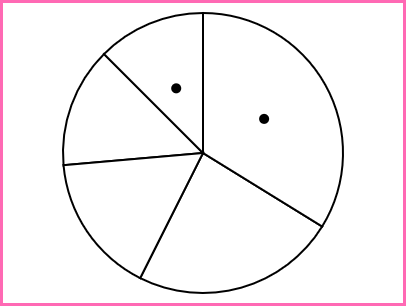
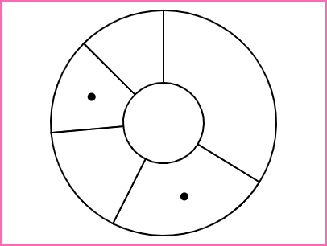
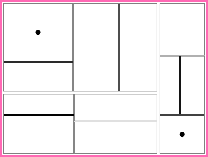
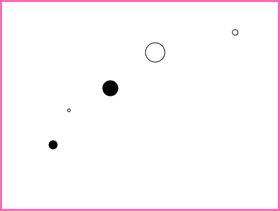

Assignment 3 - Replicating a Classic Experiment  
===

3. Your writeup (readme.md in the repo) should contain the following:


Background
---

In 1984, William Cleveland and Robert McGill published the results of several controlled experiments that pitted bar charts against pies and stacked-bar variants. 
Their paper (http://www.cs.ubc.ca/~tmm/courses/cpsc533c-04-spr/readings/cleveland.pdf) (http://info.slis.indiana.edu/~katy/S637-S11/cleveland84.pdf) is considered a seminal paper in data visualization.
In particular, they ran a psychology-style experiment where users were shown a series of randomly-generated charts with two graphical elements marked like this:


Participants were then asked, "What percentage is the smaller of the larger?". 
This was repeated hundreds of time with varying data and charts. 
By the end of the study, Cleveland and McGill had amassed a large dataset that looked like this:


__Log-base-2 or "cm-error"__: The true percent is the actual percentage of the smaller to the larger, while the reported percent is what participants reported. 
Cleveland and McGill recognized that their analyses would be biased if they took `abs(ReportedPercent – TruePercent)` as their score for error. 
To compensate, they came up with a logarithmic scale for error with this equation:


You’ll be implementing this error score as part of the lab. 
(Hint: it’s not a trick question, this is just to familiarize you with the experiment protocol). 
With this Cleveland-McGill error score you can better compare the performance of the charts you test to figure out which one performs the best.

As a baseline, compare your average Error scores to the following chart, which include both Cleveland and McGill’s results as well as more recent extensions of this experiment (lower error indicates better performance, and error bars are bootstrapped 95% confidence intervals (`http://en.wikipedia.org/wiki/Confidence_interval#Meaning_and_interpretation`)):


GitHub Details
---

- Fork the GitHub Repository. You now have a copy associated with your username.
- Make changes to index.html to fulfill the project requirements. 
- Make sure your "master" branch matches your "gh-pages" branch. See the GitHub Guides referenced above if you need help.
- Edit this README.md with a link to your gh-pages site: e.g. http://YourUsernameGoesHere.github.io/Experiment/index.html
- Replace this file (README.md) with your writeup and Design/Technical achievements.
- To submit, make a [Pull Request](https://help.github.com/articles/using-pull-requests/) on the original repository.
- Name your submission using the following scheme: 
```
a3-FirstLastnameMember1-FirstLastnameMember2-FirstLastnameMember3-...
```

CS480X Assignment 3
Clay Oshiro-Leavitt
Hunter Caouette
Nicholas Alescio

Project Page: https://clay-ol.github.io/03-Experiment/


Hypotheses:


Our testable hypothesis is that the donut chart will have the most accurate results - two frames of reference.

- Working link to the experiment hosted on gh-pages or some other site.
- Concise description and screenshot of your experiment.
- Description of the technical achievements you attempted with this project.
- Description of the design achievements you attempted with this project.

MEANS
1   donut 2.774251
2     pie 2.671841
3 scatter 3.030364
4    tree 2.964546


1 (Best Performance): Pie Chart
---



The Pie Chart visualization in our experiment produced the lowest average error of 2.67.


2: Donut Chart
---



The Donut Chart visualization in our experiment produced an average error of 2.77.


3: Tree Map
---



The Tree Map visualization in our experiment produced an average error of 2.96.


4 (Worst Performance): Bubble Chart
---



The Bubble Chart visualization in our experiment produced the highest average error of 3.03.

Design Points
---

- CSS Styling
Rather than having a barebones HTML page, we opted to style our webapp with various CSS components. We added a border to our visualization to give it some pizazz as well as used freely available Google Fonts to give the application a more modern look.
- Progress Tracker
Perhaps one of the most frustrating things a user can experience is not knowing their progress in an application. We added a simple progress tracker that illustrates the participant's progress through the experiment in the form of a fraction. Therefore, the user can always know their progress.

Tech Points
---

- Simple Mail Transfer Protocol Library
For this technical achievement, we implemented an automated results logging method using the JS SMTP library. This enables us to simply write and send an email within a Javascript method. Once the end of our experiment was reached by the user, the last button press triggers the data to be written into the body of an email which is then sent to the three of us. This removes the requirement of having the participant manually send the data to us.
- 4 charts
For this technical achievement, we decided to test 4 different visuals rather than just 3. For this 4th visualization, we opted to implement a tree chart. As we had not encountered such an example in class, this required more research and design considerations compared to our other visualization implementations.