Assignment 3 - Replicating a Classic Experiment  
===

Victoria Grasso, Matthew Hurlbut-Coke, and Nicole Shedd

Link to experiment: https://nshedd.github.io/03-Experiment/index

Our experiment compared different aspects of bar plots to determine their effectiveness. We analyzed bar plots that had a grid or not, had more marks on the y-axis, and had less marks on the y-axis. We additionally analyzed the distance between the selected bars and how that affected the results.

Our hypotheses were:
1. A bar plot with a grid behind the bars would be more effective than without the grid.
2. More marks on the y-axis would be be more effective than less marks on the y-axis.
3. More marks on the y-axis with a grid would be the most effective visualization.
4. The closer the bars were together, the less error between estimated percentage and actual.

Our experiment was created using d3 and javascript. The start page navigated the participant to the 6 different html files which randomly generated barplots under the 6 conditions: includes a grid, does not include a grid, has more markers on the y-axis with a grid, has more markers on the y-axis without a grid, has less markers on the y-axis with a grid, and has less markers on the y-axis without a grid. Once the participant had gone through the random order of trials, their data was then stored in a csv file. We compiled all the data into one csv file and used R and ggplot to analyze it.

Screenshots from experiment:
---
Barplot with a grid
-

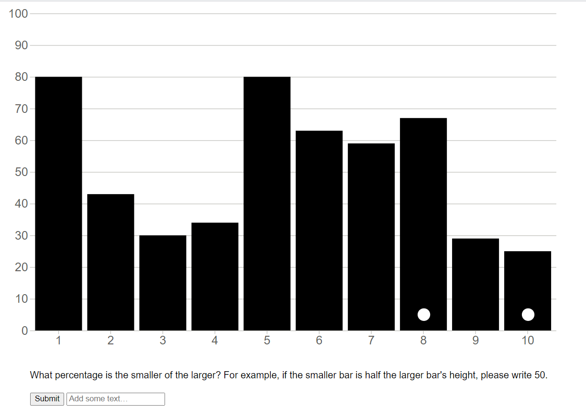

Barplot without a grid
-

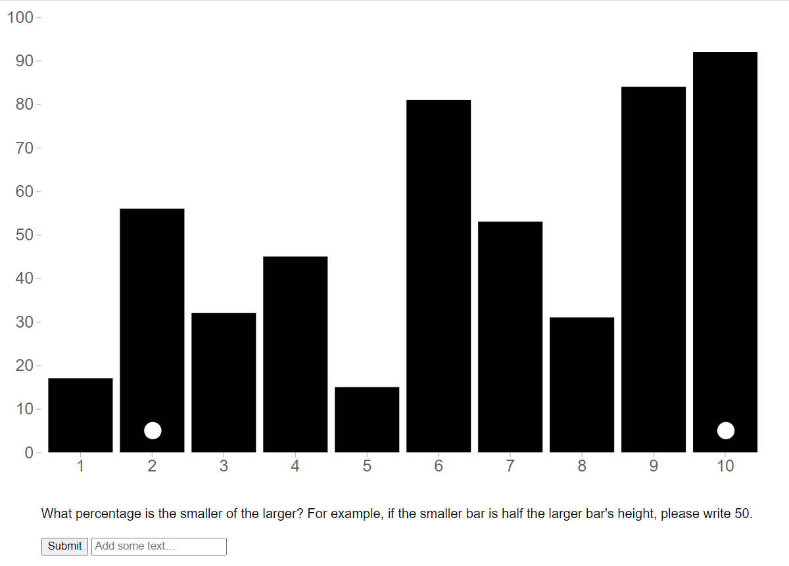

Barplot with more markers and a grid
-

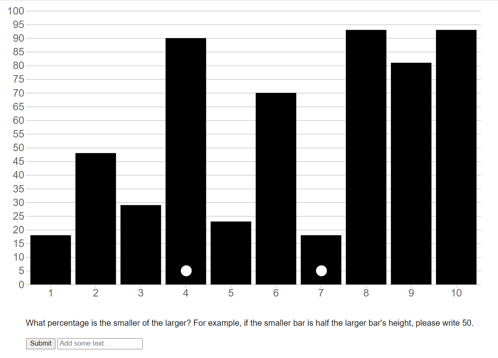

Barplot with more markers and no grid
-

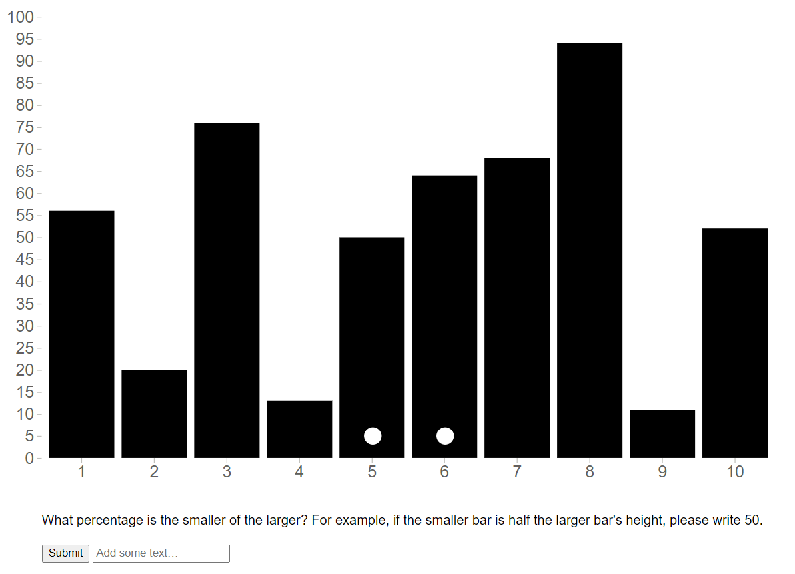

Barplot with less markers and a grid
-

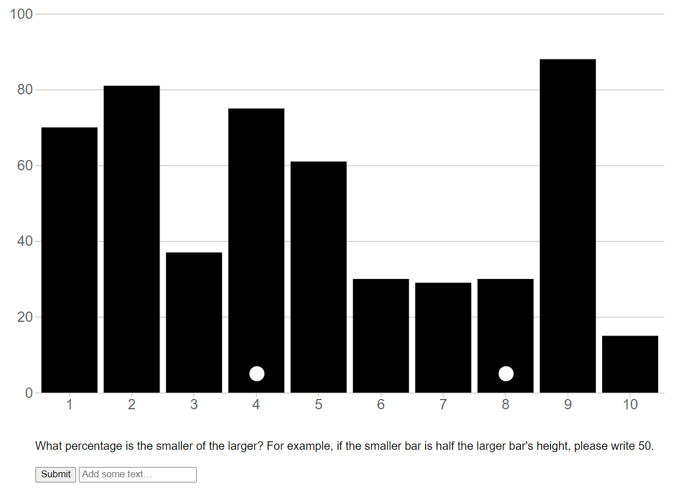

Barplot with less markers and no grid
-

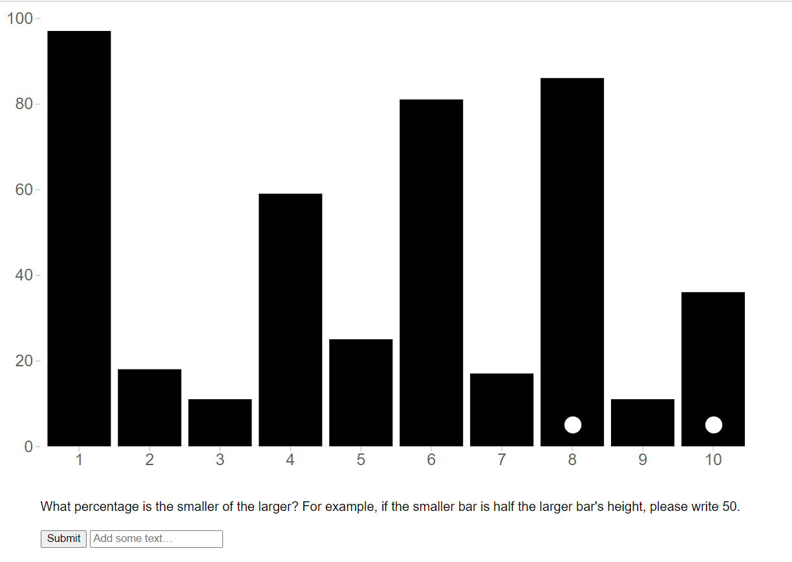

Analysis by calculating error between actual values and participants' answers:
---
Calculated error for grid versus no grid:
-

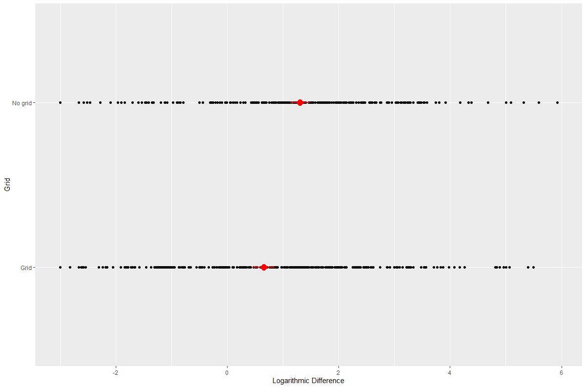

Calculated error for markers on y-axis:
-

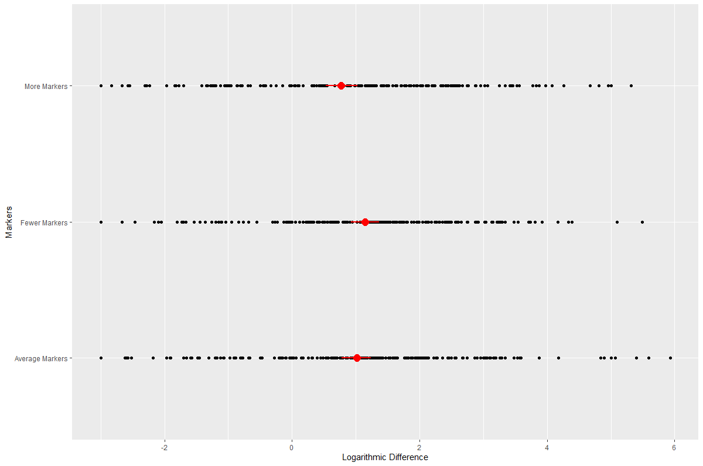

Calculated error for distance between bars:
-

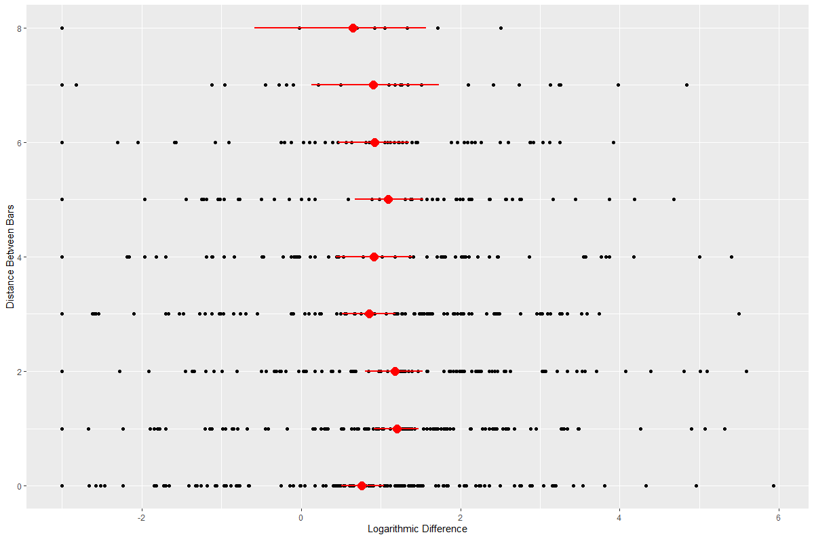

Scatter plot and linear regression comparing distance between bars and error
-

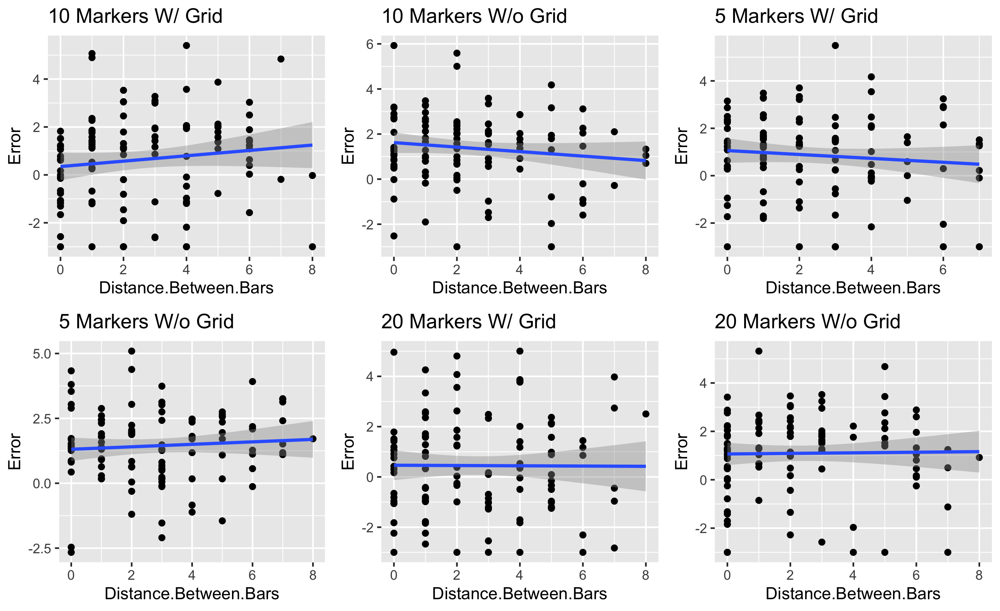

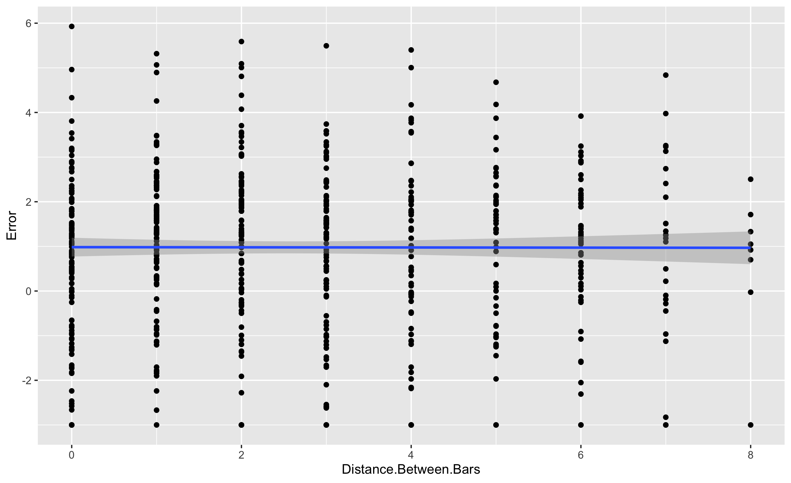

Violin plot showing distribution of error for each experiment type
-

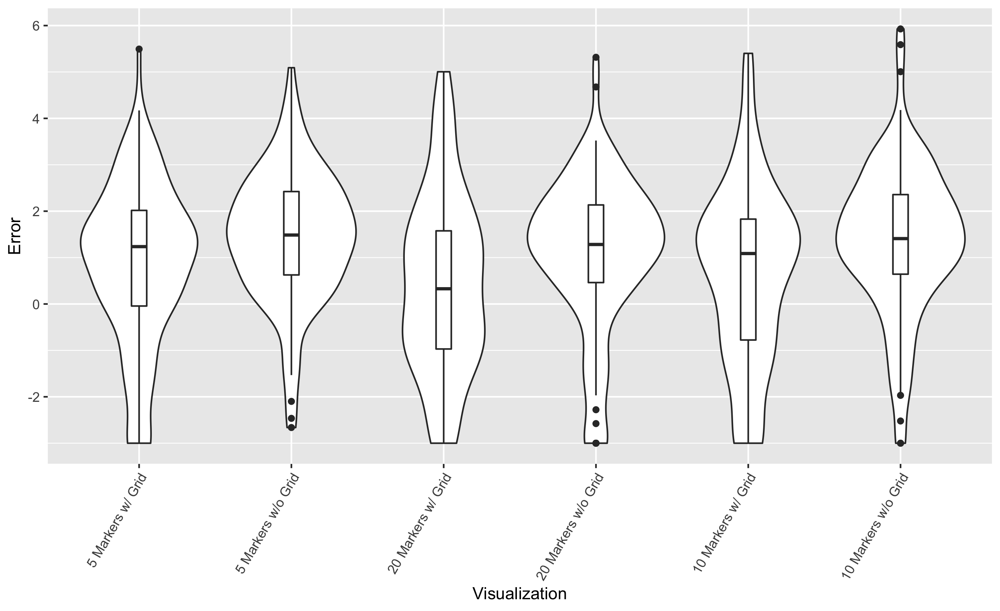

Interpretations
--

Based on the data and plots above, it was clear that error was smaller in plots with the gridlines. In addition, error decreased as the number of markers or gridlines increased. Both of these supported our original hypothesis. However, our hypothesis that error would increase as distance between bars increased was not fully supported. In some of the conditions, linear regression was positive. However, when considered overall, the regression and bootstrapped confidence interval of the data overall did not show a clear enough positive trend to support the hypothesis.

Design Achievements:
---

Technical Achievements:
---
-Used sessionStorage to store and retrieve data between pages within the experiment
-Analyzed data from 11 participants

Resources:
---
https://www.codexworld.com/export-html-table-data-to-csv-using-javascript/
https://www.w3schools.com/jsref/jsref_push.asp
https://www.codegrepper.com/code-examples/delphi/add+to+an+array+local+javascript
https://programminghead.com/how-to-link-submit-button-to-another-page-in-html.php

