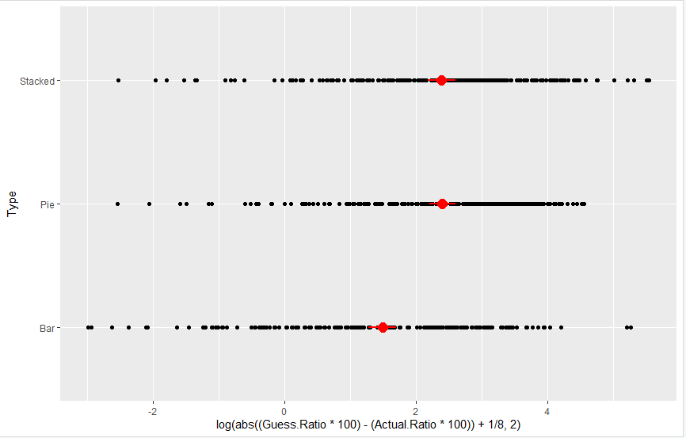

# CS 4802 Assignment 3
## Colby Frechette, Jason Dykstra
Hosted at: https://jasondykstra.github.io/03-Experiment/

## Statistics
For the statistics, we used R with ggplot2 to analyze the trends in the error. We found that the bar charts were the most easily guessed ratios, as expected. The stacked bar charts and pie charts were almost identical in spread and error, which we found to be interesting. We noticed a large amount of outliers in the stacked bar charts and even a couple in the regular bar charts, and almost none in the pie charts. This was interesting to us and led us to believe that the position of our dots could have been better to prevent mistakenly comparing the wrong bars, and other human errors from interpreting the charts. We also concluded that the point of reference for the beginning of each segment of each chart probably accounted a lot for the difference in ability o measure the percentages. E.g. pie charts and stacked bar charts' segments can start anywhere and end anywhere, however, the bar charts always begin in the same place.

# Design and Technical Achievements
Design: Changed button sizes, colors, hover changes, and overall style to make the webpage more appealing to the user. However, kept many of the same aspects as the original study to maintain consistency in the experiment. We also tried to mirror the likeness of the original experiment as much as possible. In contrast to this, we moved the dots for the comparing values outside the area to decrease the chance of the user using the dots as a frame of reference to compare the two areas.

Technical: Enter key submits text-box for each vis, to ease the flow of the program. Implemented downloading CSV to keep each participants' results separate. Added scalability by making the distribution of each chart equal when increasing or decreasing the amount of total vis'.
