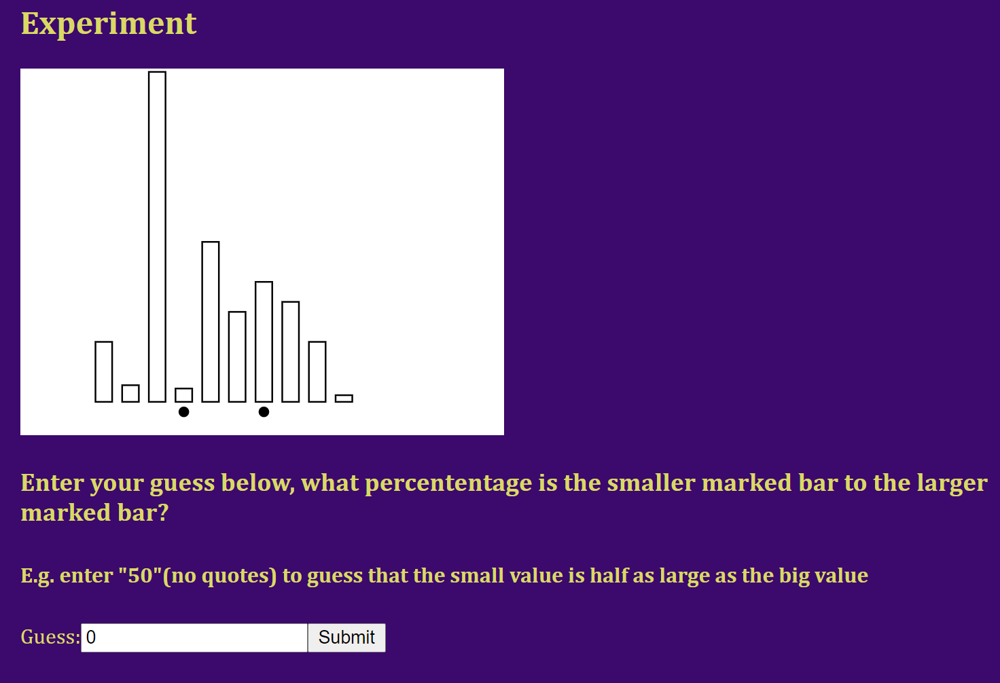
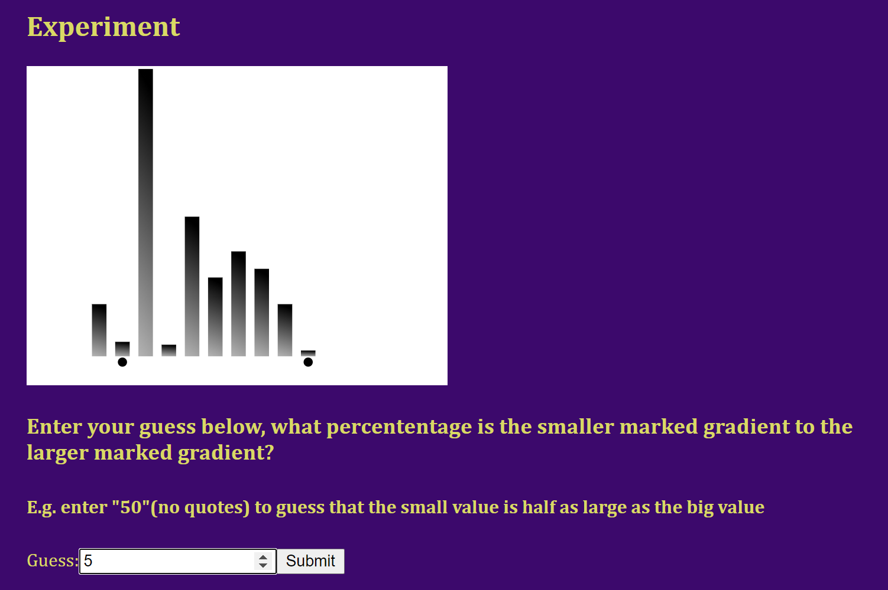
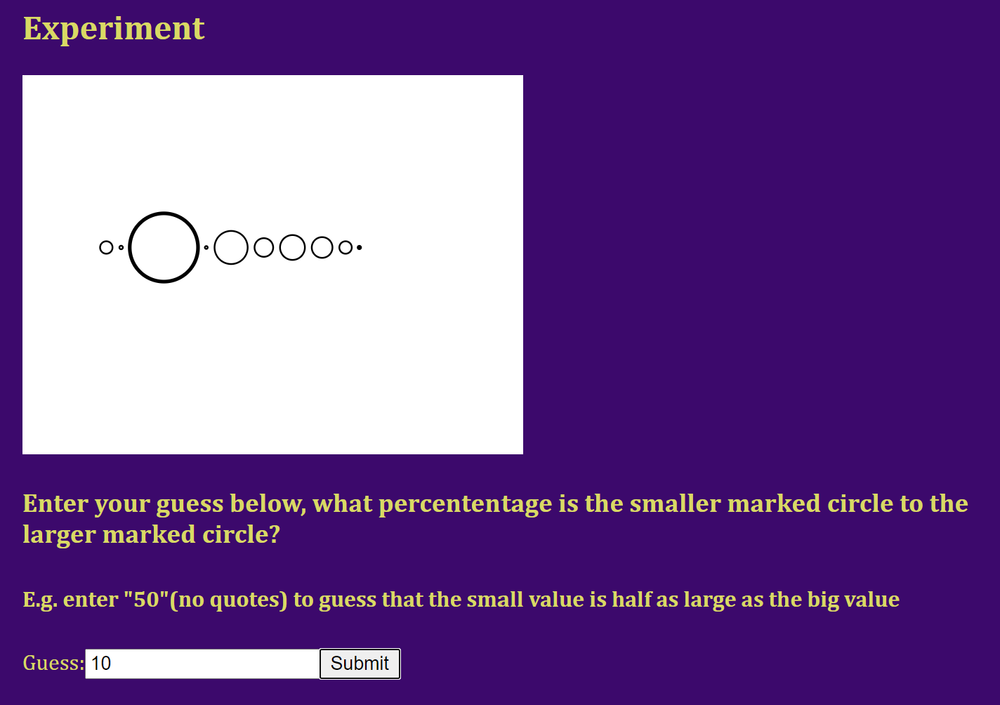
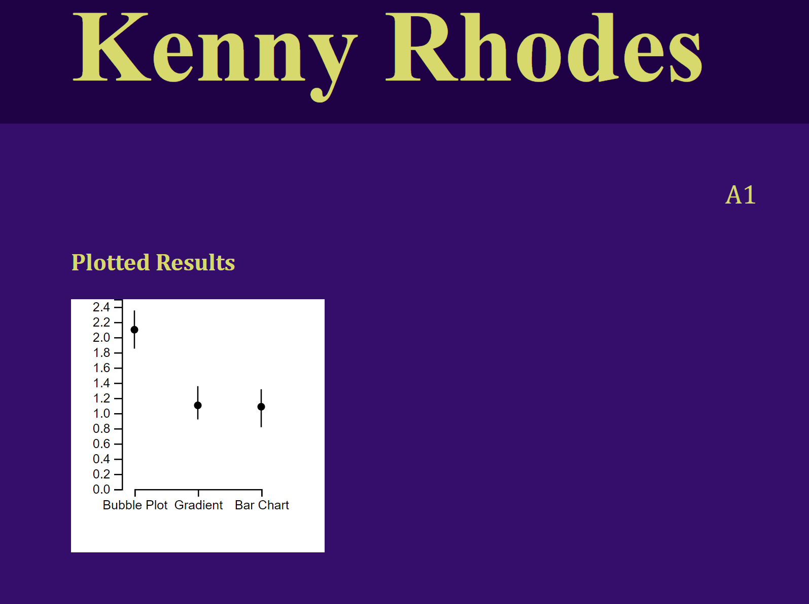

Assignment 3 - Paul Mara, Lucas Fernandes, El Sallie, Kenneth Rhodes
===
**LINK TO SITE- NOT GH PAGES**
IMPORTANT!! We are hosting this site on a website, NOT GH pages
Link below:
http://www.kennyrhodes.com/projects/cs4802/project3/experiment


**Our Charts and Hypotheses**

Chart 1: 


Chart2:


Chart3:


**Chart selection / Hypothesis**

Our first hypothesis/test was between the bar chart and the gradient bar chart. We, as the experiment scientists were curious as to how the gradient may effect estimation, for example maybe users could identify what shade of gray looks like 50%...etc. We didn't really have a basis for this one, we were curious. 

Our second hypothesis/test was between the bar chart and the circle chart. The circle chart tests area compared to the bar chart which tests how humans are perceiving length. We guessed that our subjects would be better at estimating length (bar chart)


**Experimental results / stats calculations**
 
 The results of the experiments were as follows:



As expected, the bubble plot had the highest error and was statistically signifigantly worse than the two other chart types (the confidence levels do not overlap)

The other two charts were closer. The calculated error of the gradient was slightly lower than that of the normal bar chart, but not in a statistically signifigant way. We guess that maybe participants used the gradient to gain a slight edge on how far up a bar a result was. 

We used the cleveland McGill error equation in the assignment:

 

**Design achievements**
 - Prompts given to the user were dependant on the graph selected
 - Responsive page design

**Tech Achievements**
 - Implemented a server/hosted backend that allowed each participant to add their results as they were filling it out
    - Implemented get and post http requests via the django rest framework for a database of participant results
    - Implemented experiments as a react component (modular design, can add/remove graphs in the future)
 - Implemented a live stats update vis react component where experiment results are calculated live as more results came in
    - Implemented generating and serving a CSV from a django db model 
    - Handcoded the 95% confident bootstrap algorithm in js so that we could do this


PR NAME:
```
a3-KennyRhodes-PaulMara-RachelSallie-LucasFernandes
```
