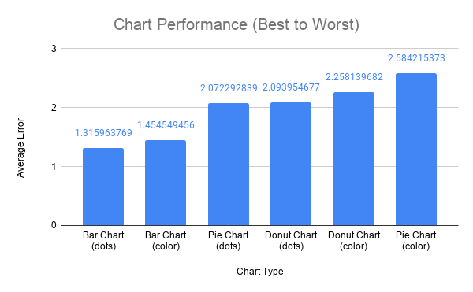
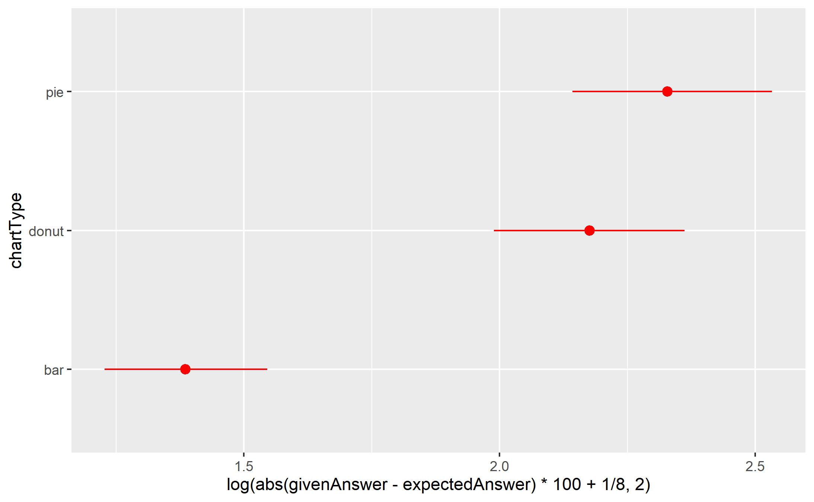
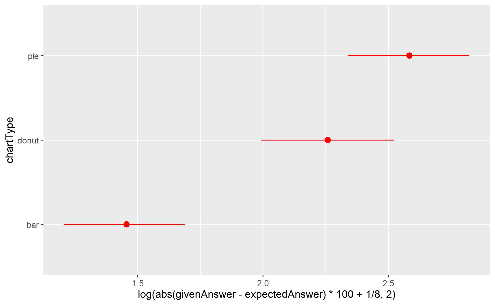
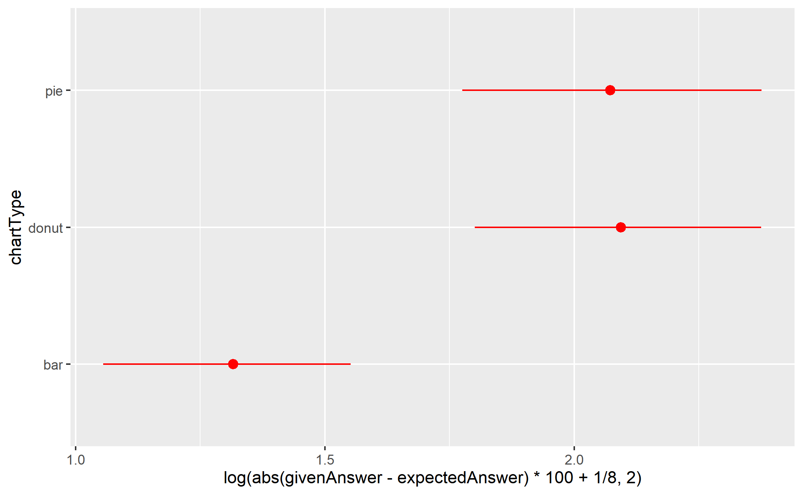

Assignment 3 - Replicating a Classic Experiment  
===

By Alexander Bell, Brian Earl, Haley Hauptfeld and Pooja Patel

Our experiment can be found [here](https://480x-21c-a3.glitch.me), which is the link to our experiment's hosting website.

We hypothesized that color does not affect how accurately we can perceive relative sizes of Bar, Pie, and Donut graphs, when compared to black-and-white versions of the same types of graphs. To test this, we ran 12 individuals through a series of randomly generated tests where each individual must compare the size difference of two selected data points on a series of graphs. For this, we chose to use a horizontal bar graph, a pie chart and a donut chart to test (images of each test can be found in the table below). Each individual was ran through 20 trials per graph type. For the first 10 trials, the graph was colored in, where the two selected data points was colored a separate color.  For the last 10 trials, the graph was in black an white, where the two selected data points were indicated with a black dot located besides them. 

Above is an screenshot what the user sees when going through the experiment. The instructions above the graph will alter themselves depending on the type of graph being shown. For inputting the desired estimate, the user is given a sider that goes between 0%-100%. After moving the slider to their guess, the user presses the "Submit Answer" button to move on to the next trial. 

Above is one graph of the results of our data. As you can see, Bar charts tended to be on average better than Donut or Pie charts. One interesting thing to note would be that the colored Pie chart's had a much larger error than the dot pie chart. THis could be due to the ordering of the elements in the experiment, where users encountered the colored pie chart first.

Above is the 95% confidence intervals for both the black-and-white and color graphs together.

Above is the 95% confidence intervals for just the color graphs.

Above is the 95% confidence intervals for just the black-and-white dot graphs.

# Chart Examples

|   Black and White Graphs    |        Color Graphs        |
| :-------------------------: | :------------------------: |
|      |  |
|      |       |
|  |   |

# Achievements

## **Technical Achievements**

- Implemented [Chance](https://chancejs.com/) in our chart generator.
- Implemented [d3-simple-slider](https://github.com/johnwalley/d3-simple-slider) for the users to input the percentages instead of having them input the numbers manually 

## **Design Achievements**

- Included an example on our introduction screen to help explain the task to the participant for effectively. 
-  Implemented [d3-simple-slider](https://github.com/johnwalley/d3-simple-slider) for the users to input the percentages instead of having them input the numbers manually 
- The instruction prompt above the graph changes depending on if the current chart is in color or is black and white

# References

For creating the graphs in our experiment, the following sites articles were referenced:

- [Bar Graph](https://bl.ocks.org/d3noob/bdf28027e0ce70bd132edc64f1dd7ea4)
- [Vertical Bar Graph](https://stackoverflow.com/questions/44817414/rotate-svg-in-place-using-d3-js)
- [Pie Chart](https://medium.com/codecakes/bts-d3-js-basic-pie-chart-d794f17b79bb)
- [Donut Chart](https://www.d3-graph-gallery.com/graph/donut_label.html)
- [Tree Map (Unused in experiment)](https://www.d3-graph-gallery.com/graph/treemap_basic.html)

For creating CSVs, this article was referenced

 - [JSON to CSV code](https://gist.github.com/dannypule/48418b4cd8223104c6c92e3016fc0f61)

For implementing the slider used in the Technical & Design acheivements, this segment of code was used

 - [d3-simple-slider](https://github.com/johnwalley/d3-simple-slider)
