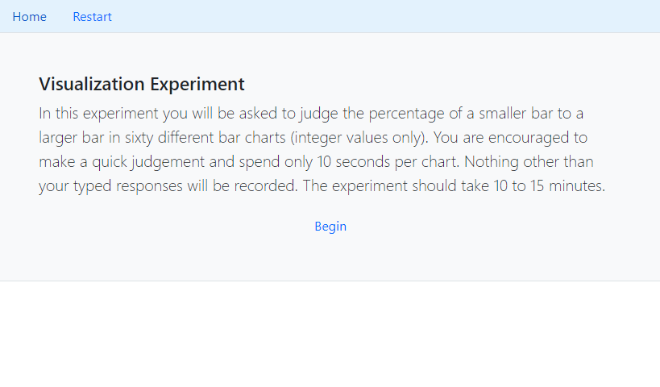
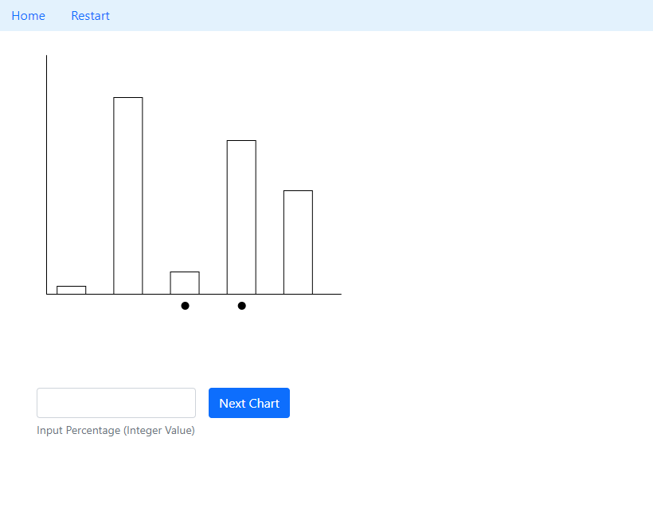
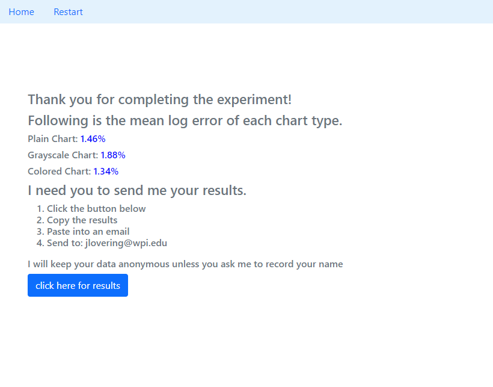
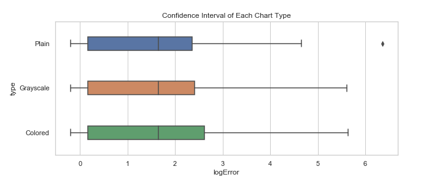

# Assignment 3 - Replicating a Classic Experiment  

[Experiment Hosted on GitHub Pages](https://jalovering.github.io/03-Experiment/)

# Experiment Description
The hypothesis being tested in this experiment was that adding categorical coloring to a bar chart would improve the accuracy of predicting bar height. Participants were asked to predict the percentage of a smaller bar to that of a larger bar in various charts. The three color palettes chosen to conduct this experiment were:
    1. Plain (no categorical varibality)
    2. Grayscale (colorless categorical variability)
    3. Colored (colored categorical variability)
Thirteen participants were presented with 20 of each type of chart, in random order. There were 260 data points collected for each chart, totalling 780 predictions.

The first page of the experiment explained the instructions and provided relevant information to the participants.

The second page of the experiment was where the participants would spend most of the time. This page generated random charts and collected participant predictions.

The third and final page presented the participant with their average log2error for each type of chart as well as instructions for submitting their data.

# Experiment Results
In conclusion, there was no evidence to support that adding color to a bar plot would improve the accuracy of predicting bar height. While individual participants had varying averages across the different charts, the compiled averages were extremely close. The Grayscale had a mean error of 1.525, followed by 1.591 and 1.592 from the Plain and Colored charts, respectively. The variability between these results is too minor to justify concluding any chart type performed better than another. The 95% confidence intervals are displayed below.

# Referenced Code
- https://www.d3-graph-gallery.com/graph/barplot_basic.html

This example was referenced for the structure of creating a barplot in d3 v4.

# Achievements
## Design Achievements
My design achievement was making this experiment as user friendly as possible. To start, I used JavaScript Bootstrap to make the interface. Boostrap results in a clean, that most users would already be familiar with the style. Furthermore, for the colored plot, I used a colorblind friendly palette. I found the palette on a [popular website made by David Nichols](https://davidmathlogic.com/colorblind/#%23332288-%23117733-%2344AA99-%2388CCEE-%23DDCC77-%23CC6677-%23AA4499-%23882255). 

## Technical Achievements
My technical achievement was collecting user inputs as variables in order to use the data throughout the remainder of the experiment. By doing this, I was able to compile the predictions in a dictionary alongside the type of chart and true value. On the results page, I created a link for the user to press which would open their JSON results in a new tab to copy and send to me. Each dictionary could be appended to a main dictionary within my analysis notebook to allow for easy compilation of results. 