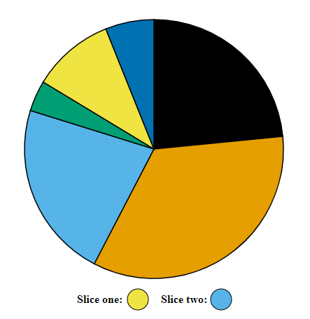
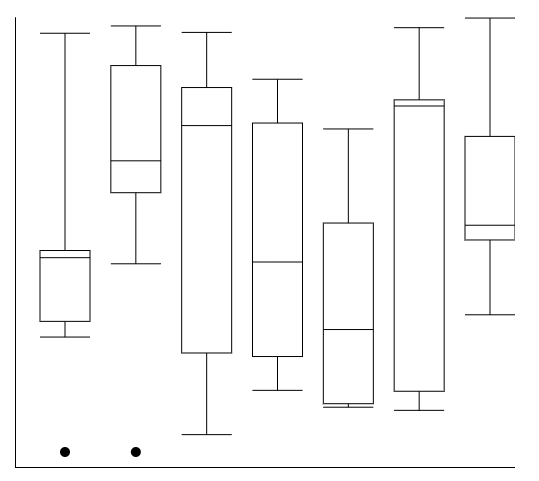
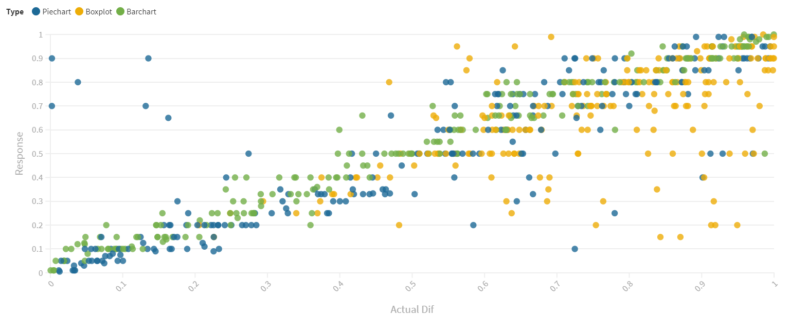

Assignment 3 - Replicating a Classic Experiment  
===

N'yoma Diamond, Felix Chen, Luke Gebler

Github Pages Link: https://nyoma-diamond.github.io/03-Experiment/

Experiment
===
For our experiment we showed each participant 20 instances of each visualization. Starting with the pie chart, moving on to the box plots, and finally the bar chart. The box plots and bar charts were each marked with 2 dots, signifying which parts of the chart we want to compare. The pie chart was given different colors for each piece and a key was given to signify which slices should be compared. 

Visualizations
===
Each of the visualizations were generated randomly.

Our bar chart was our best performing chart by a wide margin. This is similar to Cleveland & McGill's results, as it is easiest to compare two bars height as oppose to other visualizations.

Our pie chart was significantly worse in performance compared to the bar chart, but beat out box plots by a small margin. While the majority of pie chart data had only a small amount of error, it had significantly more drastic outliers compared to the bar chart. 

Box plots were the worst performing chart out of the three. This could be for a couple reasons, our first theory is the lack of knowledge about how to read a box plot. Some people may have factored in the tail into their calculations while others did not. This caused for a wide variability in answers, creating more outliers compared to the other two charts. 

This visualization helps show why one visualziation did better than the other as it plots each individual data point on a graph. Barcharts appear to follow the trendline no matter the differentiation in height. Pie charts seem to be harder to read the smaller the actual difference between the slices are, while box plots seem to struggle on the other end of the graph, where the actual difference is greater.

Achievements
===
Technical
-We implement box plots as one of our visualizations, a much harder to implement chart compared to others
-Instead of locally storing the data, we used the online service "formspree" to gather and compile all of our data allowing us to easily export it as a csv to do analysis on

Design
-The pie chart is using a color-blind friendly color pallete in order to remove that variable from the data

