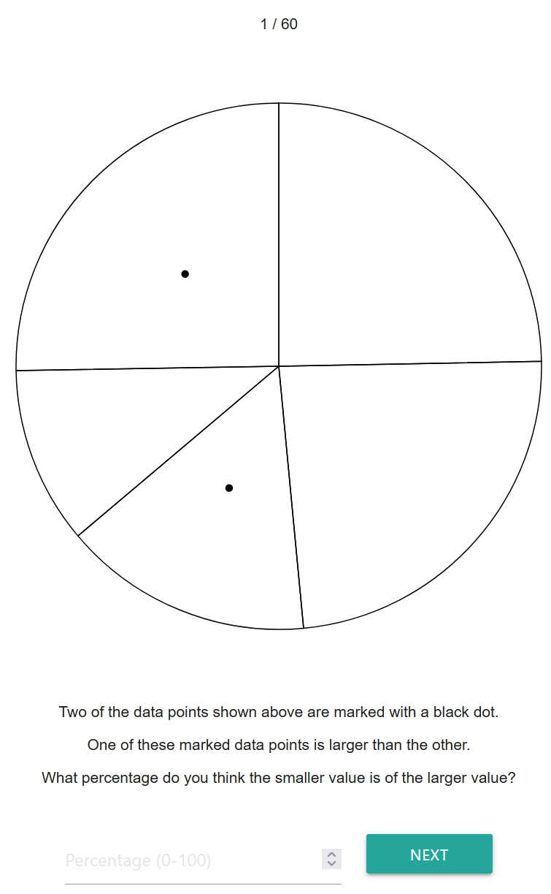
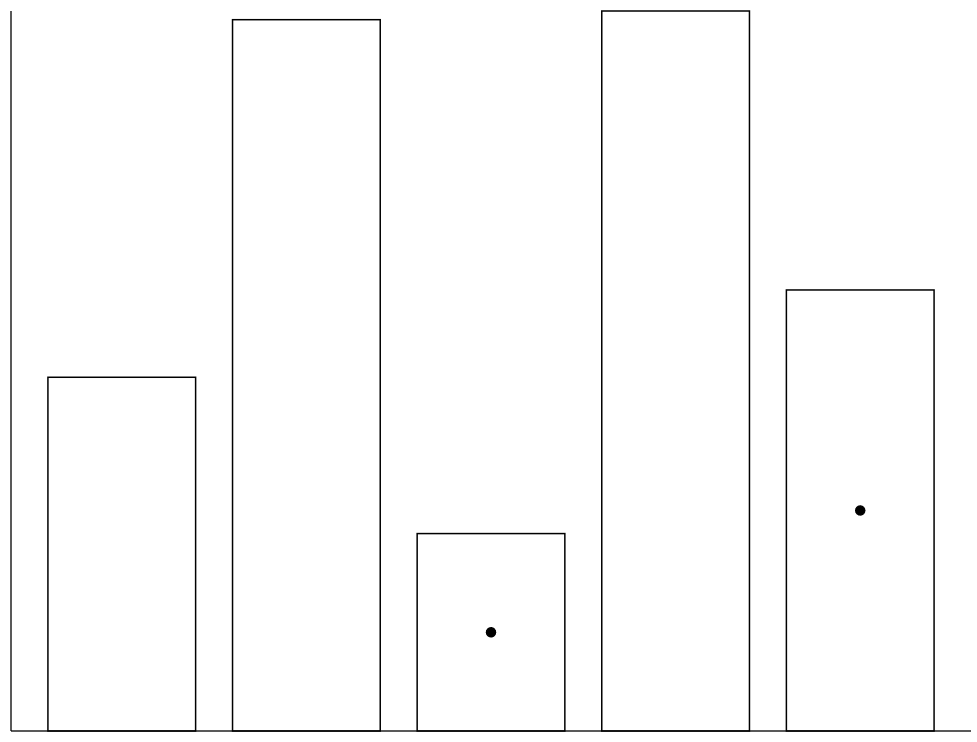
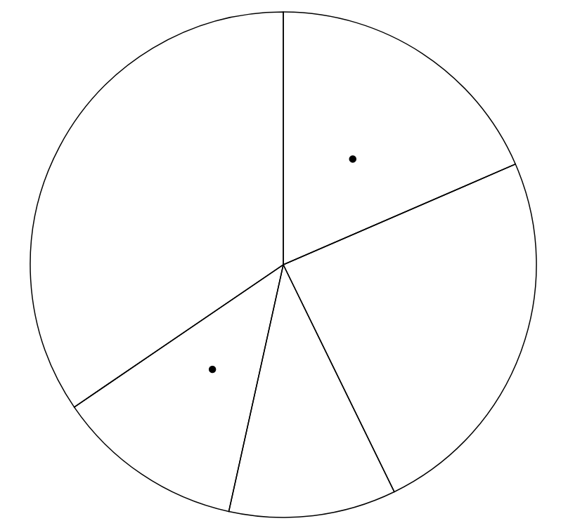
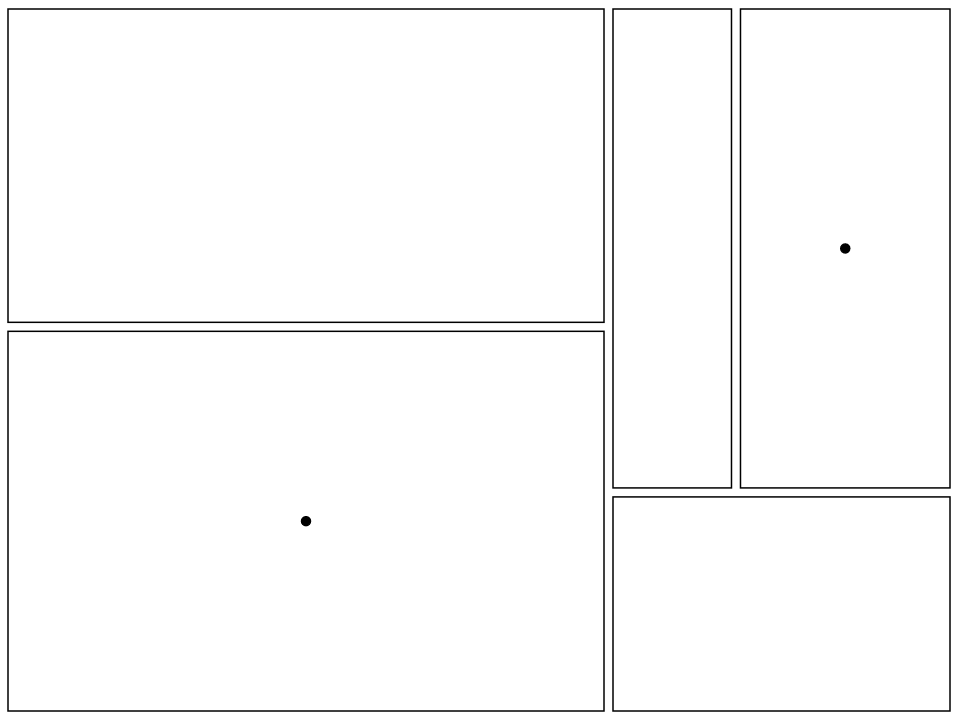
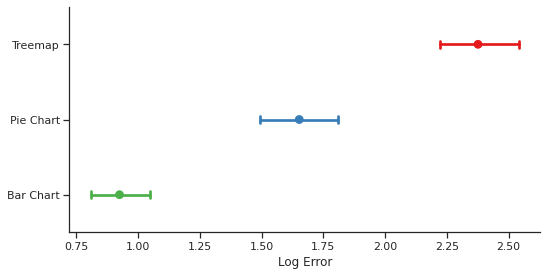

Assignment 3 - Replicating a Classic Experiment  
===

Rob Chiocchio

Survey link: https://cs480x-03-experiment.herokuapp.com/

---

For this experiment, I tested the effectiveness of bar charts, pie charts, and rectangular area charts as data visualization methods. I chose these three visualization types because I was curious how easy rectangular area charts are to interpret compared to more standard visualization methods like bar charts and pie charts. To compare them, I created a web survey that generates 60 random data visualizations (20 of each type). In each visualization, 2 elements of the total 5 are marked. The participant is asked to estimate the relation between the marked data points by guessing what percentage the smaller data point is of the larger. After each guess, all the information gets recorded to a dataset along with a calculated error value. The results of this survey were analyzed using Python to determine which data visualization methods are the most effective.

Survey
---

Visualization Methods
===

Bar Chart
---

Pie Chart
---

Tree Map (Rectangular Area Chart)
---

Results
===

In conclusion, the rectangular area charts (tree maps) turned out to be the least effective at representing the data. Bar charts appear to be the best choice for this kind of data visualization, outperforming both the tree maps and pie charts.

Achievements
===
### Technical Achievements
- Experiment hosted on custom Node.js webserver using Express
- Automatically saved survey results to a PostgreSQL database

### Design Achievements
- Designed the experiment site using the PUG template engine
- Used the Materialize framework for a nicer survey layout

References
===
- https://d3-graph-gallery.com/barplot.html
- https://d3-graph-gallery.com/pie.html
- https://d3-graph-gallery.com/treemap.html
- https://expressjs.com/en/starter/generator.html