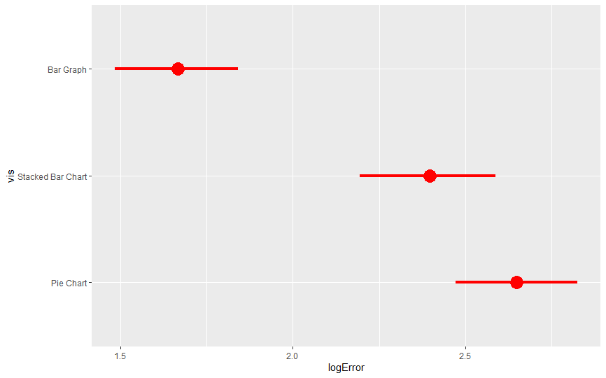

# The Visualization/Experiment

authors: Kavtaradze Elene, McKeen Joshua, Truong Shannon

Our experiment is hosted live and can be found at: <https://ekavtaradze.github.io/03-Experiment/>

# Our hypothesis:

We predict that the ranking of effectiveness in human perception of data will be the most effective in the bar chart, followed by the stacked bar chart and pie chart, respectively. Users will be able to more accurately compare two given data structures in the bar chart because it has been shown that the magnitude channels on ordered attributes rank positioning on a common scale (bar chart) to be the most effective, followed by the position on an unaligned scale (stack bar chart) and the angle (pie chart) to be the least effective.

# Working on the d3 Visualizations and the Experiment Design

The experiment uses the following graphs:

-   Bar chart
-   Pie chart
-   Stacked bar chart

The graphs utilized in this experiment were generated with reference to examples listed on the d3 graph gallery. The experiment itself includes 60 pages with 20 examples of each graph. The order of the graphs is randomly generated. Additionally, the data we display in our charts are also generated randomly using a randomly generated number script. The experiment itself is taken and a reference to the Cleveland and McGill Graphical Perception experiment. Similar to the Cleveland and McGill Experiment, the participants are asked to compare the two marked graphical elements and to provide their closest guess in the text box before moving forward.

**Note: Our visualization and error reports require a csv file to be downloaded from the experiment site upon submission. These reports were submitted to us via email.**

We received datasets from 12 participants totaling 240 trials per chart to analyze by the end of the experimentation phase.

## Bar Charts

The above image is an example of a possible bar chart that is displayed in our experiment given during our trials. The two selected graphical elements participants were asked to compare were generated randomly for every generated bar chart.

## Stacked Bar Charts

The above image is an example of a possible stacked bar chart that is displayed in our experiment given during our trials. The two selected graphical elements participants were asked to compare were again generated randomly and decided upon randomly for every visualization of a stacked bar chart.

## Pie Chart

The above image is an example of a possible pie chart that is displayed in our experiment given during our trials. The two selected graphical elements or 'slices' presented to the participants were again generated randomly for every pie chart generation. In order to place the dots and mark which slices to compare, the built in d3 centroid() function was used to calculate the location at the middle of the slice we would like the participant to reference when comparing.

# Results/Error Analysis

This is a small subset of our collected data. All our user submissions are collected in the userSubmissions directory. We merged all of the user datasets into one
Excel file called fullData.xlsx. The error calculation was done in Excel. First, we applied the error formula given in Cleveland and McGill `log with base 2 of (abs(ReportedPercent – TruePercent) +1/8)` in column called logr. Then in column logError, we checked for -3 values and converted them to 0. -3 value is for cases when the reportedPercent matches truePercent(the guess was 100% correct), and in this case, the error should be 0. We only eliminated one outlier in the data. The truePercent was 80, and the reportedPercent was 1000 which created an outlier. We believe that this is due to an input/human error, inputing 1000 instead of 100. We decided to exclude that row from calculations.
vis and logError columns were used to create a visualization in R.

Looking at the logError and analyzing the results, we can see that our hypothesis above holds true. The true percent is the actual percentage of the smaller to the larger graphical element in each chart, while the reported percent is what participants reported in the trials. Utilizing the Cleveland and McGill method, `abs(ReportedPercent – TruePercent) +1/8`, as their score for error and having this be on a logarithmic scale with base 2 to propagate error, we can see in the graphical analysis above that participants most likely were able to perceive data more accurately when presented using a bar chart. The pie chart clearly resulted in a more inaccurate reading of data, whereas the stacked bar chart came in as the second most effective graphical display. It is important to note that the error calculated for the stacked bar chart, however, was evidently closer to the error in accuracy when reading a pie chart.

# Technical Achievements

  - We utilized d3, html/javascript, R, and Excel to complete this assignment
  - We eliminated data outliers in our final dataset
  - We converted -3 log error values to 0

# Design Achievements

  - Our experiment resembles the example given
  - The final results graph produced in R has the chart types ordered by the value of errors

Resources used:

-   csv download https://seegatesite.com/tutorial-read-and-write-csv-file-with-javascript/
-   <https://www.d3-graph-gallery.com/index.html>
