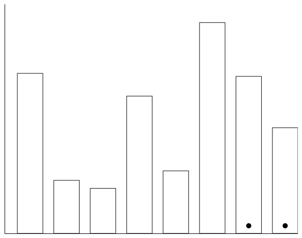

# Overview

Our submission for Assignment 3 consists of a simple display of three visualizations along with input for the user to guess the ratio between the size of two selected visualization components. Once the user has guessed for all three visualizations, their results are sent to a Firebase database for analysis. Our three different visualizations were:
1. A twist on the bar chart
2. A tree map
3. A pie chart

As per the assignments, each visualization randomly consists of 5-10 items with a random size from 0-100. The order of the visualizations is also randomized.

A number of libraries were used to aid us in the development of this assignment:
* D3.js for the visualizations
* Firebase for storing data
* Fingerprint.js for identifying users
* Google's Material Components for Web for input components

## Visualization 1

This visualization, designed by Stokley, consists of sequential bars ordered by and colored according to their size.

## Visualization 2

This visualization, designed by Dyllan, is a standard tree map.

## Visualization 3

This visualization, designed by Alan, is a standard pie chart.

# Results
### Hypothesis
Our hypothesis was that sequential bar graphs would best allow, from our 3 graphs, for the user to determine differences in data points.
### Data
From the data we collected and put into report.csv we found that the sequential bar graph had the lowest errors. It was followed by the tree map then the pie chart.

 
The graph displays the error of the visualization. The points flanking the average, Top CI and Bottom CI, denote the maximum and minimum respectively of the bootstrapped
95% confidence interval.

# Achievements
### Design
- Size-dependent coloring on Visualization 1
- Utilized Google's material design components for the web for input & cards

### Technical
- Smooth transitions between visualizations
- Data is automatically sent to a Firebase database
- Node.js script to get data from firebase into csv

# Authorship

Built by Dyllan Cole, Alan Curiel, and Stokley Voltmer
