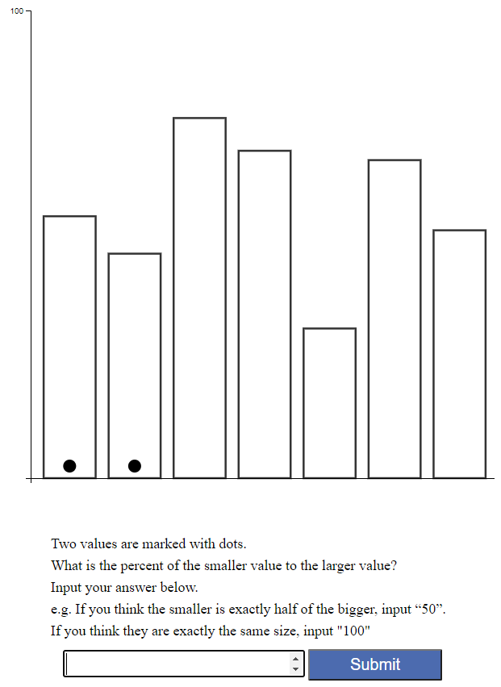
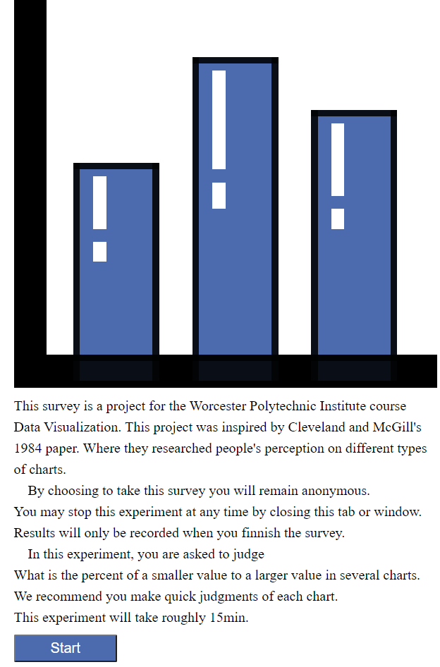

Assignment 3 - Replicating a Classic Experiment
---
Project By Benjamin M'Sadoques and Nicolas Fish

Survey Site: https://a3-a-classic-experiment-2.glitch.me
Note:You will probably get a short loading screen since the website goes to sleep. 

Code Host: https://glitch.com/edit/#!/a3-a-classic-experiment-2

github pages: https://bgmsadoques-wpi.github.io/03-Experiment/  
Note: only hosts the index.md file 

Description
---
This project was inspired by Cleveland and McGill's 1984 paper, where they researched people's
perception on different types of vis.
In this experiment we tested people’s perception on three types of charts: Bar, Radar, and Tree map.
We left the charts colorless, so we do not bias results.

Bar Chart
---
The Bar chart was our baseline, and we expect this chart to be perceived
most accurately as the bars are aligned.
It is also the most common of the three charts so testers may be familiar with it.

Radar Chart
---
Those that have not seen this chart before may have difficulty reading the Radar chat
and may largely impact the error. We expect this chart to preform the worst,
even though it is a type of circular bar chart the tester may have difficulty
comparing two bars as they are not aligned. We choose this chart type because
we wanted to test a circular scale chart, but we wanted to choose one that is less common
than a pie chart.

Tree Map
---
Humans are not good at judging area, so we expect this chart to perform poorly.
We expect the tree map comparison to out perform the Radar chart and under preform the Bar chart.
We placed the indicator circles in the bottom right of the areas rather than the center as we
believe this will interfere less with perception as it does not give the tester a center point
of reference. We choose a tree chart because we wanted to compare area to other types of charts
tree maps are somewhat common area charts.

Results
---

After looking through the data we found some questionable results though the error rates
are not too far from the baseline. Comparing the error results to those of the Cleveland and
McGill’s paper we predict that some testers may have been confused by the instructions as we see
the overall error rate increased. Surprisingly, the Radar chart did perform better than the Tree
map as testers had a more difficult time perceiving area rather than the unconventional Radar chart.

We feel the instructions were not clear enough in the experiment.
One participant included more precision such as entering 33.33333333.
A few people were confused by the instructions and had to ask us questions about
how to answer the questions.

If we were to do this experiment again, we would add more chart types.
We would tweak the instructions so people do not put answers with extra precision.
We would put the survey on a survey taking service, such as Amazon mechanical turk,
so we could get more participants. We would have to change the website to handle
turk's system and add some bot detection and defense.

Technical Achievement
---

The technical achievement for this project was to have the survey record results automatically in one master CSV file.
On the server.

The first step to this process was to find a method to communicate with the server side.
Pure Javascript only runs on the client side, the only way to get results would be to have the user
download the CSV and give it to us. This result would allow the user to tamper with the test.
We found that github pages offers no server side interactions, it only hosts a static site,
so there is no way to put the results on the server. We found that Node Js would provide
javascript on both the server and client side, so we can use libraries such as d3 on the
server to read the CSV.  

The second step was to find a hosting service that allowed us to make a simple node js server application.
We looked at a few such as Azure, and IBM, but eventually we found glitch.com. It provided free hosting
at the cost that the website is shut down when it is inactive. It provided a simple Node JS project
with express js to start us off.   

link to hosting service website:  
https://glitch.com/   

the third step was to communicate with the server side to enter the results.
At first, I thought to get the result index at the start of the survey,
then enter the result with that index at the end of they survey. This process made sense,
until I realized that there was a race condition, if two people start at about the same time
they will get the exact same result number, since results are only entered at the end of the survey.
I changed the code, so it gets the result number when it tries to enter the result.
This process should not have a race condition, but it may be possible to have the same result number
if two people submit the survey at the same time. We could have used a more-unique identifier,
such as a name or IP address, but we wanted to keep people anonymous. We could have used a large random number,
but we were not sure if that would play well when we had to make the final chart.

The fourth step was to create a start and end page to the survey. We wanted a separate start and end page to the
survey, but we were not sure how to have the server direct people to separate pages.
Eventually we figured out that we can have express js listen for a http get request on any url in our domain.
On the client side, we just redirect the user to a different URL, then the server sends them the html document.

Design Achievement
---

Our design achievement for this project was styling and making the survey look professional.

The first step was to style the survey itself. We decided to center the charts on the page
and align the text left, so it is easier to read. We made the text box turn red if the user did not enter
something, as a reminder to have them enter a result. We made it so people can either press enter
or click the button to get to the next chart.

The second step was to add the icon. Every professional page has an icon, so it just made sense.
We wanted a simple icon that clearly shows the site is about charts. Bar charts are recognizable,
and it is possible to encode one with low resolution. We created a small and simple icon png
that shows a bar chart.

The third step was to create a start page to the survey. We wanted to inform participants
properly on why they are taking this survey, how information will be collected, and what
they will be doing during the survey. We created a bigger version of the icon to serve
as our project logo.

Finally, we created an end page to stop the survey and thank the participant.
We used the same picture from the start of the survey.

