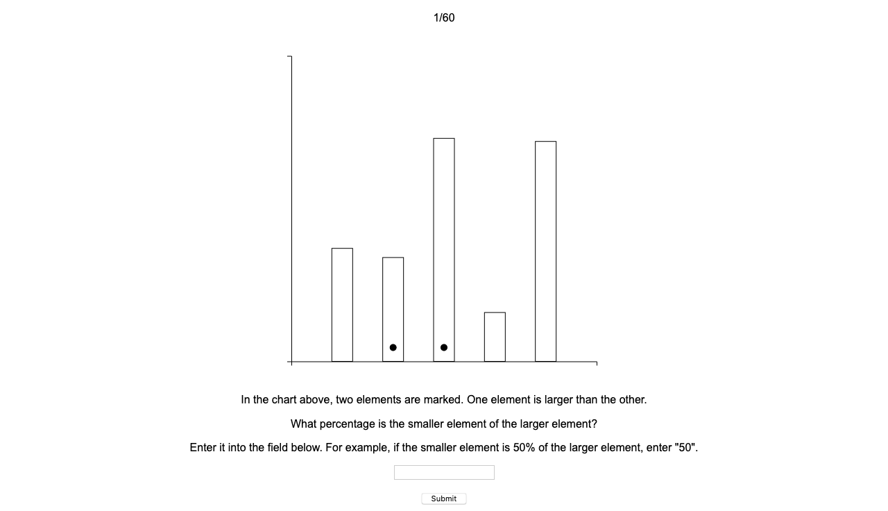
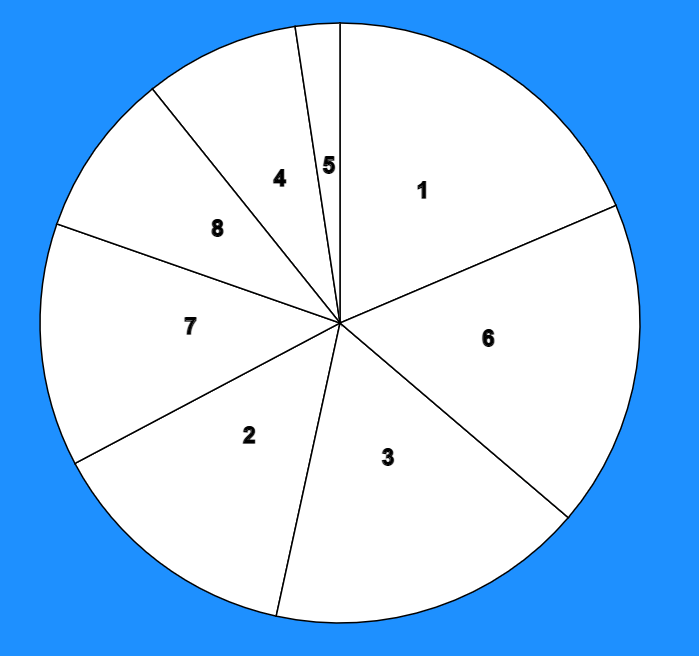

# Assignment 3

This experiment tested three different types of visualizations to determine their effectiveness. These visualizations were a bar chart, a pie chart, and a circular bar chart.

Our hypotheses for each visualization were:
* The pie chart would perform worse than the circular bar chart.
* The circular bar chart would preform in between the bar chart and the pie chart. 
* The bar chart would perform the best out of all three visualizations.

To test the visualizations, participants were asked to complete a form showing 60 of them in a random order. Each visualization contained two marked elements, and participants were asked to input the percentage the smaller element was of the larger element.

To determine how effective each visualization was, we calculated the error of participants' responses and ranked the visualizations according to their error. Below is the 95% confidence interval of the error:

## Visualization Examples

### Bar Chart

### Pie Chart

### Circular Bar Chart

## Design Achievements
* Visually enhanced the webpage by changing the font.
* Results are conditionally shown in green or red to display to the user whether they were close or far from the true percent.
* The webpage displays an error message if the user input is invalid. The error message tells the user what they should input.

## Technical Achievements
* Used a Node.js server and HTTP requests to create csv files for each trial.
* Used Vue.js to handle form responses and conditionally display content.
* Implemented a feature to allow users to view their responses after the experiment has been completed.

## References
* https://www.d3-graph-gallery.com/graph/pie_annotation.html
* https://www.d3-graph-gallery.com/graph/circular_barplot_basic.html
* https://towardsdatascience.com/calculating-confidence-interval-with-bootstrapping-872c657c058d